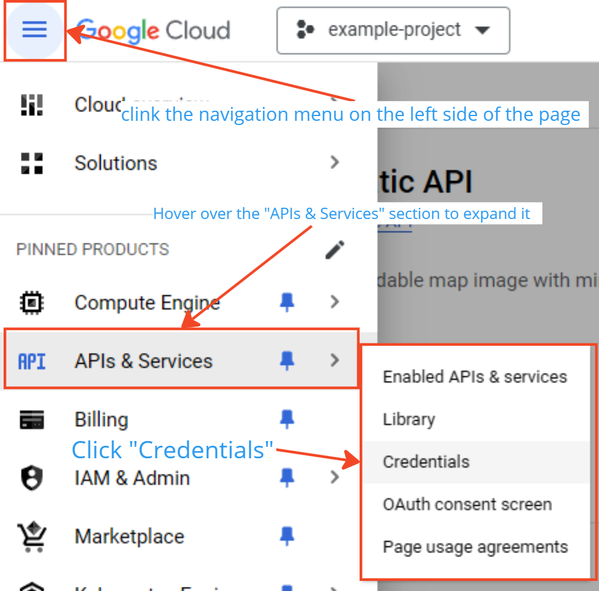

# Obtaining Google Maps Static API Key

To use the Google Maps Static API in your application, you need to obtain an API key.

Follow these steps:

1. Go to the Google Cloud Console: [https://console.cloud.google.com/](https://console.cloud.google.com/)

   

2. Create a new project or select an existing one.

   

3. Enable the Google Maps Static API:

   1. In the sidebar, click on "APIs & Services" > "Library"
   2. Search for "Maps Static API"
   3. Click on "Maps Static API" and then click "Enable"

   

4. Create credentials for the API:

   1. In the sidebar, click on "APIs & Services" > "Credentials"
   2. Click "Create Credentials" and select "API Key"

   

5. Restrict the API key (recommended):

   1. In the API key details page, click "Restrict Key"
   2. Under "Application restrictions", choose "IP addresses" and add your organization's ASN IP
   3. Under "API restrictions", select "Restrict key" and choose "Maps Static API"

   

6. Copy the API key and paste it into your `App.config` file:

```xml
<add key="GoogleMapsApiKey" value="YOUR_API_KEY_HERE"/>
```
